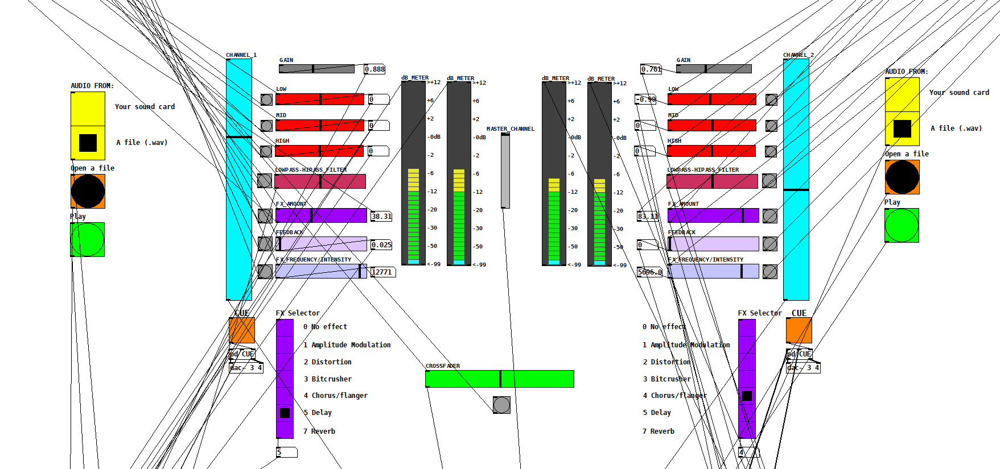

# dj-mixer

A two-input stereo DJ mixer for Pure Data.

Load a .wav file from your file explorer or use the inputs of your sound card.

FX:
- Amplitude Modulation
- Distortion
- Bitcrusher
- Chorus/Flanger
- Delay
- Reverb
